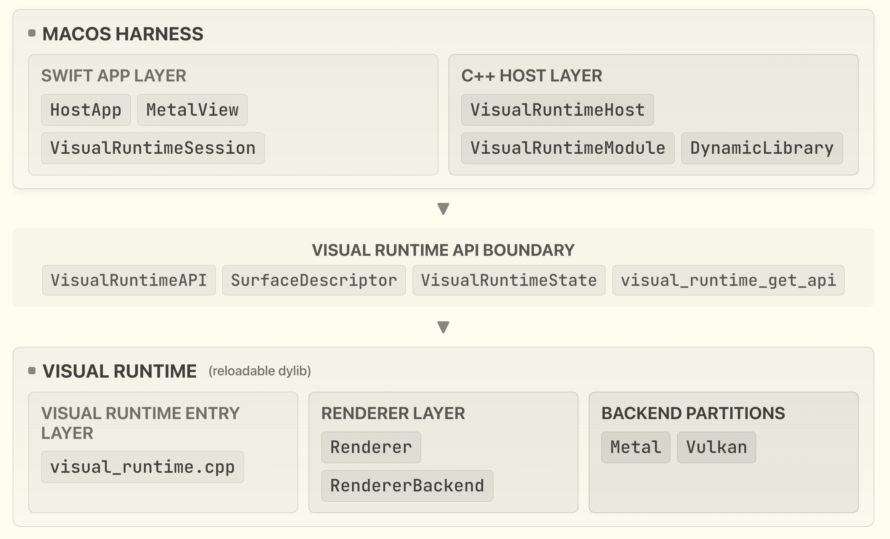

# Graphics Engine Cohort Harness

## Overview

This is the codebase for the Graphics Engine Cohort: a product-driven case study where you build a renderer grounded in a specific use case rather than following prescribed steps.

The project is split into two layers: an **engine** that owns all rendering & interaction logic, and a **host** that owns the app shell and loads the engine at runtime. You work on the engine side for the most part; harness changes will usually be provided as the product brief evolves.

The current hosts are a native macOS Metal window, a minimal Linux GLFW/Vulkan window, and a small CLI loop, but the architecture keeps rendering code out of the app target so the engine can evolve independently.

You can also recompile and reload the engine while the host is running with no restart required.

### Architecture at a glance

The diagram below shows the main pieces you will see in the codebase.



## Prerequisites

### macOS

This project requires Xcode 15 or later. Install it from the Mac App Store if you haven't already. Everything else is available via Homebrew:

```sh
brew install cmake ninja just
```

If you want to modify the macOS project itself, you may also need `tuist` (`brew install tuist`) to generate the Xcode project. `xcbeautify` is optional but makes Xcode build output readable (`brew install xcbeautify`).

### Linux

Linux users should use the Vulkan backend and the minimal GLFW harness. Follow the dependency and build instructions in [`host/glfw-minimal/README.md`](host/glfw-minimal/README.md).

## Getting Started

Configure and build everything:

```sh
just build
```

All artifacts land in `build/`.

To generate IDE tooling (clangd, etc.):

```sh
just compile-commands
```

### macOS GUI host

Open the Xcode project:

```sh
just macos-open
```

Or build and launch from the command line:

```sh
just macos-run
```

### Linux GLFW host

Build and run the minimal GLFW harness:

```sh
just glfw-build
just glfw-run
```

Hot reload works the same way: run `just engine Vulkan` in a separate terminal while the app is running.

## Usage

### CLI host

Run the engine headlessly. The host ticks the engine twice per second and prints frame info to stdout:

```sh
just run
```

**Hot reload** — in a second terminal, rebuild only the engine dylib:

```sh
just engine
```

The running host detects the changed file and reloads it mid-session. You'll see `[host] reloaded (frame N)` in the first terminal. There's a `VERSION` string in `core/src/engine.cpp` you can change to confirm the reload is live.

### macOS GUI host

```sh
just macos-run
```

Opens a native Metal window. Hot reload works the same way: run `just engine` in a separate terminal while the app is running.

## Project Structure

```
engine/
├── core/      # Engine shared library (libengine.dylib) — renderer, shaders, public API
├── host/      # Harness layer — engine module loader, CLI, macOS, and GLFW hosts
├── third_party/    # Third-party dependencies (glm, metal-cpp)
└── justfile   # Task runner — prefer this over invoking cmake directly
```

## Key Concepts

**Harness vs. engine.**
The host is the harness: it owns the window, the run loop, and the dylib lifecycle. The engine owns all rendering. They share nothing except the structs in `core/include/engine/api.h`. This boundary is the central design constraint of the course.

**Versioned engine ABI.**
`engine_get_api` is the only exported C-linkage entry point. It returns an `EngineAPI` struct of function pointers tagged with `abi_version` and `struct_size`. The host validates both before calling anything. Mismatches are caught and reported rather than crashing, which makes it safe to reload a dylib compiled against a different build.

**Hot reload mechanism.**
`DynamicLibrary::changed()` compares the dylib's mtime on every tick. When a change is detected, `EngineModule::reload()` calls `shutdown()` on the old API, unloads the dylib, reloads it, re-binds the function pointers, and calls `init()` again. The host process and its window never stop.

**Metal shader pipeline.**
Shaders are compiled by CMake via `xcrun metal` and `xcrun metallib` into a `.metallib` bundle. The path is baked in at compile time as `ENGINE_SHADER_LIB_PATH`. Changing a shader requires `just engine`, which triggers a full engine rebuild including shader recompilation.

## Configuration

| Variable | Type | Default | Description |
|---|---|---|---|
| `ENGINE_BACKEND` | CMake string | `Metal` | Renderer backend. Supported values: `Metal`, `Vulkan`. |
| `CMAKE_BUILD_TYPE` | CMake string | `Debug` | Standard CMake build type. |

`ENGINE_BACKEND` is passed via the `backend` argument to just recipes, e.g. `just build Metal`. `CMAKE_BUILD_TYPE` is currently fixed to `Debug` by the configure recipe.
